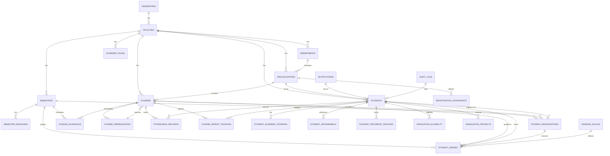

# Entity-Relationship Diagram (ERD) & Database Architecture

## Complete ERD (Mermaid Diagram Format)



---

## Database Schema Relationships

### 1. **UNIVERSITIES** (Root Entity)
```
universities (id, code, name_en, name_ar, country, city, email, phone, website, is_active)
    ↓
    ├─→ faculties (faculty_id)
    ├─→ departments (via faculties)
    └─→ All other entities (via faculties)
```

### 2. **FACULTIES** - Multi-tenant Support
```
faculties (id, university_id, code, name_en, name_ar, dean_name, is_active)
    ├─→ departments (faculty_id) - 1:N
    ├─→ specializations (faculty_id) - 1:N
    ├─→ courses (faculty_id) - 1:N
    ├─→ academic_rules (faculty_id) - 1:N (FLEXIBLE RULES)
    ├─→ students (faculty_id) - 1:N
    └─→ semesters (faculty_id) - 1:N
```

### 3. **SPECIALIZATIONS** - Program Structure
```
specializations (id, department_id, faculty_id, code, name_en)
    ├─→ students (specialization_id) - 1:N
    ├─→ courses (specialization_id) - 1:N
    └─→ registration_constraints (specialization_id) - 1:N
```

### 4. **COURSES & PREREQUISITES** - Curriculum
```
courses (id, faculty_id, code, name_en, credit_hours, level, is_mandatory)
    ├─→ course_prerequisites (course_id) - Many:Many (recursive)
    ├─→ student_registrations (course_id)
    ├─→ student_grades (course_id)
    ├─→ course_schedules (course_id)
    └─→ attendance_records (course_id)

course_prerequisites (course_id, prerequisite_course_id, min_grade, is_strict)
    └─→ Creates dependency graph for prerequisites
```

### 5. **SEMESTERS & DEADLINES**
```
semesters (id, faculty_id, academic_year, semester_number, start_date, end_date)
    ├─→ semester_deadlines (semester_id)
    ├─→ student_registrations (semester_id)
    ├─→ student_grades (semester_id)
    ├─→ course_schedules (semester_id)
    └─→ student_progress_tracking (semester_id)
```

### 6. **STUDENTS** - Core Entity
```
students (id, student_id, faculty_id, specialization_id, email, cgpa, current_level)
    ├─→ student_registrations (student_id)
    │   └─→ student_grades (student_registration_id)
    ├─→ student_academic_standing (student_id) - 1:1
    ├─→ student_progress_tracking (student_id)
    ├─→ student_withdrawals (student_id)
    ├─→ graduation_eligibility (student_id) - 1:1
    ├─→ graduation_projects (student_id)
    └─→ course_repeat_tracking (student_id)
```

### 7. **REGISTRATION FLOW**
```
student_registrations (id, student_id, semester_id, course_id, status)
    ↓
    ├─→ status: 'Registered' → student is enrolled
    ├─→ status: 'Withdrawn' → student drops course
    ├─→ status: 'InProgress' → semester ongoing
    └─→ status: 'Completed' → course finished
```

### 8. **GRADING MODULE**
```
student_grades (id, student_registration_id, course_id, semester_id)
    ├─ coursework_score (40% weight)
    ├─ midterm_score
    ├─ final_exam_score (60% weight, min 30%)
    ├─ total_score (calculated)
    ├─ grade_letter (A+, A, B+, ..., F)
    └─ grade_points (4.0, 3.7, 3.4, ..., 0.0)
    
grading_scales (faculty_id, grade_letter, min_percentage, max_percentage, grade_points)
    └─→ Maps score ranges to letter grades
```

### 9. **ACADEMIC STANDING MODULE**
```
student_academic_standing (student_id, gpa, cgpa, is_on_warning, warning_count)
    ├─ is_on_warning: CGPA < 2.0
    ├─ consecutive_warning_count: resets if > 1 semester without warning
    ├─ total_warning_count: cumulative
    ├─ is_dismissed: true if (4 consecutive OR 6 total warnings OR > 8 semesters)
    └─ is_honors_eligible: CGPA ≥ 3.0 AND no F grades AND ≤ 8 semesters
```

### 10. **FLEXIBILITY: ACADEMIC RULES ENGINE**
```
academic_rules (id, faculty_id, rule_code, category, rule_data [JSON])
    ├─ rule_code: 'REG_MAX_CREDITS_FRESHMAN', 'WARNING_CGPA_THRESHOLD', etc.
    ├─ category: 'Registration', 'GPA', 'Attendance', 'Dismissal', etc.
    ├─ rule_data: JSON { "value": 27, "condition": "max", "level": 1 }
    ├─ effective_from/effective_to: Date-based activation
    └─ is_active: Boolean flag for feature toggles

ALLOWS: Different universities can have different rules!
```

### 11. **UNIQUE CONSTRAINTS & INDEXES**

| Table | Unique Key | Purpose |
|-------|-----------|---------|
| students | (faculty_id, student_id) | Ensure unique student IDs per faculty |
| student_registrations | (student_id, semester_id, course_id) | Prevent duplicate registrations |
| course_prerequisites | (course_id, prerequisite_course_id) | Prevent duplicate prerequisites |
| semesters | (faculty_id, academic_year, semester_number) | One semester per term |
| grading_scales | (faculty_id, grade_letter) | Unique grades per faculty |
| academic_rules | rule_code | Unique rule identifiers |

### 12. **PERFORMANCE INDEXES**

```sql
-- Student lookups
CREATE INDEX idx_student_faculty ON students(faculty_id, is_active);
CREATE INDEX idx_student_id ON students(student_id);
CREATE INDEX idx_student_email ON students(email);

-- Registration queries
CREATE INDEX idx_registration_student_semester ON student_registrations(student_id, semester_id);
CREATE INDEX idx_registration_course_semester ON student_registrations(course_id, semester_id);

-- Grade queries
CREATE INDEX idx_grades_student ON student_grades(student_id, course_id);
CREATE INDEX idx_grades_semester ON student_grades(semester_id);

-- Course lookups
CREATE INDEX idx_course_faculty ON courses(faculty_id, code);
CREATE INDEX idx_course_level ON courses(level);

-- Rule queries
CREATE INDEX idx_rules_faculty_category ON academic_rules(faculty_id, category);
```

---

## Cardinality Summary

| Relationship | Type | Min | Max |
|-------------|------|-----|-----|
| University → Faculty | 1:N | 0 | ∞ |
| Faculty → Specialization | 1:N | 0 | ∞ |
| Specialization → Student | 1:N | 0 | ∞ |
| Student → Registration | 1:N | 0 | ∞ |
| Registration → Grade | 1:1 | 0 | 1 |
| Course → Prerequisites | N:M | 0 | ∞ |
| Semester → Deadline | 1:N | 1 | ∞ |
| Faculty → Rule | 1:N | 0 | ∞ |

---

## Data Integrity Rules

### Cascade Operations

| Operation | Cascade Behavior |
|-----------|-----------------|
| Delete University | CASCADE → Delete Faculties, Departments, All related data |
| Delete Faculty | CASCADE → Delete Specializations, Students, Courses, etc. |
| Delete Course | CASCADE → Delete Prerequisites, Registrations, Grades |
| Delete Student | CASCADE → Delete Registrations, Grades, Standing, etc. |
| Delete Semester | RESTRICT → Cannot delete (enforce manually) |

### Trigger Rules (Application-Level)

```php
// Trigger: When Final Grade is Set
ON INSERT student_grades:
    1. Calculate final score (40% coursework + 60% final exam)
    2. Assign grade letter and points
    3. Update student CGPA
    4. Check academic standing
    5. If CGPA < 2.0 → isOn Warning = true
    6. If warnings ≥ 4 consecutive OR ≥ 6 total → isDismissed = true

// Trigger: When Course Registration Changes
ON INSERT student_registrations:
    1. Check prerequisites
    2. Check credit limits
    3. Check registration deadline
    4. Check student not dismissed
    5. Add to schedule
    6. Send confirmation

ON DELETE student_registrations:
    1. Remove from schedule
    2. Recalculate total credits
    3. Update student progress
    4. Send withdrawal confirmation
```

---

## Multi-Tenant Data Isolation

### By Faculty ID

Every major table includes `faculty_id` for isolation:
- students.faculty_id
- courses.faculty_id
- specializations.faculty_id
- academic_rules.faculty_id
- semesters.faculty_id

### Query Pattern for Multi-Tenant Safety

```php
// Laravel - Always filter by faculty
Student::where('faculty_id', auth()->user()->faculty_id)->get();
Course::where('faculty_id', auth()->user()->faculty_id)->get();
```

### Rule Isolation Example

```php
// University A: Max credits = 27 for freshmen
academic_rules.rule_data = {"max_credits": 27, "level": 1}

// University B: Max credits = 30 for freshmen
academic_rules.rule_data = {"max_credits": 30, "level": 1}

// Both use same rule_code: 'REG_MAX_CREDITS_FRESHMAN'
// Just different rule_data values!
```

---

## Query Examples for Common Operations

### 1. Get Student's Courses This Semester

```sql
SELECT c.* FROM courses c
JOIN student_registrations sr ON c.id = sr.course_id
JOIN semesters s ON sr.semester_id = s.id
WHERE sr.student_id = ? AND s.is_active = TRUE
AND sr.status != 'Withdrawn';
```

### 2. Check Prerequisites for a Course

```sql
SELECT c.* FROM courses c
JOIN course_prerequisites cp ON c.id = cp.prerequisite_course_id
WHERE cp.course_id = ?;
```

### 3. Calculate Student CGPA

```sql
SELECT 
    SUM(sg.grade_points * c.credit_hours) / SUM(c.credit_hours) as cgpa
FROM student_grades sg
JOIN courses c ON sg.course_id = c.id
WHERE sg.student_id = ? AND sg.is_first_attempt = TRUE;
```

### 4. Find Students on Academic Warning

```sql
SELECT s.* FROM students s
JOIN student_academic_standing sas ON s.id = sas.student_id
WHERE s.faculty_id = ? AND sas.is_on_warning = TRUE;
```

### 5. Check Graduation Eligibility

```sql
SELECT 
    SUM(c.credit_hours) as total_credits,
    COUNT(DISTINCT sr.course_id) as courses_passed,
    AVG(sas.cgpa) as cgpa
FROM student_registrations sr
JOIN courses c ON sr.course_id = c.id
JOIN students s ON sr.student_id = s.id
LEFT JOIN student_academic_standing sas ON s.id = sas.student_id
WHERE s.id = ? AND sr.status = 'Completed'
HAVING total_credits >= 132 AND cgpa >= 2.0;
```

---

## Schema Normalization

### Normal Form Analysis

| Table | 1NF | 2NF | 3NF | Notes |
|-------|-----|-----|-----|-------|
| students | ✓ | ✓ | ✓ | Fully normalized |
| courses | ✓ | ✓ | ✓ | Fully normalized |
| student_registrations | ✓ | ✓ | ✓ | Fully normalized |
| student_grades | ✓ | ✓ | ✓ | Fully normalized |
| academic_rules | ✓ | ✓ | ✓ | JSON for flexibility |
| registration_constraints | ✓ | ✓ | ✓ | Fully normalized |

### Denormalization Strategy

Minimal denormalization for performance:
- `students.cgpa` - Cached value (recalculated when needed)
- `students.current_level` - Calculated from credits_passed
- `student_registrations.status` - Derived from dates and completions

---

## Migration Order (Dependency Chain)

```
1. universities
2. faculties (FK → universities)
3. departments (FK → faculties)
4. specializations (FK → departments, faculties)
5. course_categories
6. courses (FK → faculty, specialization, category)
7. course_prerequisites (FK → courses) ← SELF-REFERENCING
8. registration_constraints (FK → specialization)
9. grading_scales (FK → faculty)
10. academic_rules (FK → faculty)
11. semesters (FK → faculty)
12. semester_deadlines (FK → semester)
13. students (FK → faculty, specialization)
14. student_academic_standing (FK → student, semester)
15. student_progress_tracking (FK → student, semester)
16. student_registrations (FK → student, semester, course)
17. student_grades (FK → registration, student, course, semester)
18. course_schedules (FK → course, semester)
19. attendance_records (FK → student, course, semester)
20. student_withdrawals (FK → student, semester)
21. graduation_eligibility (FK → student)
22. graduation_projects (FK → student)
23. course_repeat_tracking (FK → student, course)
24. notifications (FK → student, faculty)
25. audit_logs
```

---

## Backup & Recovery Strategy

### Critical Tables (Daily Backups)
- students
- student_registrations
- student_grades
- student_academic_standing

### Configuration Tables (Weekly)
- academic_rules
- registration_constraints
- grading_scales
- courses
- specializations

### Reference Data (As-needed)
- universities
- faculties
- departments
- semesters

### Point-in-Time Recovery
- Maintain binary logs
- 30-day retention for academic data
- Keep audit_logs intact for compliance

